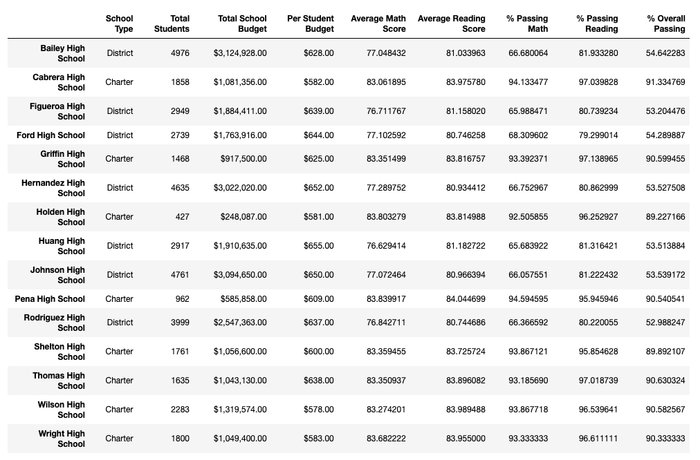

# 04-School_District_Analysis

## Overview
The school district requested we analyze data to create a snapshot of testing metrics based on grade, school type, budget, and school size. 

After completion of the initial analysis, academic dishonesty was reported within a group of students after test scores were found to be altered. In order to uphold state testing standards, the group of altered scores were removed from the data set and the analysis was redone. 

## Results
### District Statistics
* Total Schools: 15
* Total Students: 39,170
* Total Budget: $24,649,428.00
* Average Math Score: 78.93
* Average Reading Score: 81.86
* % Passing Math: 74.76%
* % Passing Reading: 85.66%
* % Overall Passing: 64.86%

### Individual School Statistics

### Highest Performing Schools
#### *Based on percentage of students passing __both__ math and reading*

### Lowest Performing Schools
#### *Based on percentage of students passing __both__ math and reading*

## Analysis 
### Test Scores by Grade -- Math

### Test Scores by Grade -- Reading

> Test scores show very little change over time within each school. Schools that have higher scores remain constantly high, schools with lower scores are equally steady. 

### Test Scores by Budget -- Per Student Spending

> Interestingly, the highest performing schools were the ones with the lowest per-student spend. This raises many questions, such as: if schools with higher per-student budgets are performing poorly, is this an indication of misappropriated funding? Can the budgets of these high-spend, low-performance schools be re-allocated to increase academic performance? 

### Test Scores by School Size -- Total Student Population

> Unsurprisingly, the largest schools performed significantly lower than schools with lower populations. While exact class sizes are not known based on the data shown, it is a safe assumption student to teacher ratios are higher in the larger schools -- a factor that has been shown to contribute to lower student performance on standardized tests. 

### Test Scores by School Type -- Charter vs. District

> Equally unsurprising, Charter schools out perform District schools almost 2 to 1 when comparing the number of students who are passing both math and reading. Again, student to teacher ratios and budget allocation are likely large contributors to these results. 

## Academic Dishonesty
A total of 461 students -- 0.012% of the school district -- were involved with the alleged grade altering. These students' grades were removed from the final analysis to prevent inaccurate reporting in our analysis. 

The total number of students used to calculate and analyze the district metrics was 38,709. 

### Original District Statistics, pre-academic dishonesty
*All metrics overall decreased when the altered scores were removed from the overall district statistics. Original scores and statistics are listed below, along with the difference in the original score vs. the corrected score in parenthesis.*

* Average Math Score: 78.99 (+0.06)
* Average Reading Score: 81.88 (+0.02)
* % Passing Math: 74.98% (+0.22%)
* % Passing Reading: 85.81% (+0.15%)
* % Overall Passing: 65.17% (+0.31%)

### Original Thomas High School Statistics, pre-academic dishonesty
*As with the overall district numbers, the original metrics for THS were higher than the corrected scores except with the average reading score. Oddly enough, the grade alteration actually __lowered__ the average score for the school.*

* Average Math Score: 83.42 (+0.07)
* Average Reading Score: 83.85 (-0.05)
* % Passing Math: 93.27% (+0.08)
* % Passing Reading: 97.31% (+0.29%)
* % Overall Passing: 90.95% (+0.32%)

### Effect of Academic Dishonesty 
Because Thomas High School was already a high performing school, the grade alterations had little to no effect on the school's overall test scores or its ranking within the district. 
